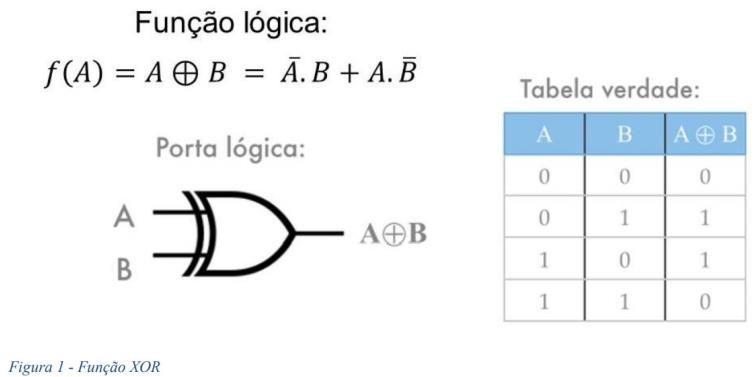
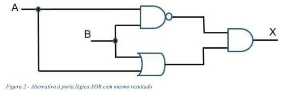

# Atividade 1: Redes Neurais Artificiais e suas Principais Aplicações

## CENTRO UNIVERSITÁRIO SENAC
SANTO AMARO

### Pós-graduação em Inteligência Artificial
**Redes Neurais Artificiais e suas Principais Aplicações**

---

## ATIVIDADE 1:
**Elaboração de Projeto para Classificação XOR utilizando Redes Neurais**

**Professor:** David Berto Farias

---

### 1. DESCRIÇÃO DA ATIVIDADE

#### 1.1.1 OBJETIVO

Predizer o resultado de uma porta lógica XOR por meio de uma rede neural artificial com FeedFoward em Python, sem a ajuda de bibliotecas de machine learning. Entregar o script (.py, .jpynb, .txt etc.) com o código e comentários.

#### 1.1.2 CONTEXTO

Uma porta lógica XOR (Figura 1) é amplamente utilizada em circuitos eletrônicos para processamento de sinais e tomada de decisões. Com duas entradas binárias (A e B), é possível obter apenas uma saída binária (A B). Com as entradas binárias, desenvolver uma rede neural com atualização de pesos feedforward para prever a saída da porta XOR (Figura 1).

É possível criar uma rede com quantas camadas ocultas e neurônios forem necessários. Sendo assim, é aconselhado criar funções para replicar camadas e neurônios. Outra possibilidade de modelagem é utilizar outras portas lógicas, conforme demostrado na Figura 2 (ref.: 2).

#### Figura 1: Função lógica XOR.

#### Figura 2: Alternativa à porta lógica XOR com o mesmo resultado.

---

### 1.2. REFERÊNCIAS PARA O DESENVOLVIMENTO

- Notas de aula;
- [Portas lógicas XOR](https://embarcados.com.br/xor/)
- [O que são portas lógicas? Tipos e características!](https://www.manualdaeletronica.com.br/o-que-sao-portas-logicastiposcaracteristicas/)
- [Minicurso: Teoria das Redes Neurais Artificiais](https://www.youtube.com/playlist?list=PLZ3V9XyVA529kELNCTwtV46fTbpzHAcrd) (IA EXPERT ACADEMY, 2022);
- **Make your Own Neural Network**: A gentle journey through the mathematics of neural networks, and making you own using the Python computer language - Tariq Rashid.

---

### 1.3. CRITÉRIOS CONSIDERADOS NA AVALIAÇÃO

- Não utilizar bibliotecas de redes neurais como: tensorflow, pytorch, sklearn, keras, MXNet, Jax, etc.;
- Criação de função Python (def);
- Manipulação de listas, tuplas, etc.;
- Utilização de bibliotecas de manipulação de tabelas;
- Modelagem do problema;
- Criação da rede neural feedforward.
