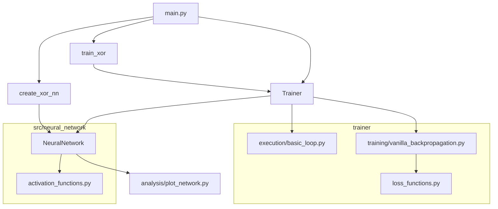

# 🧱 Arquitetura da Solução

Este documento descreve a arquitetura geral da solução para a classificação da porta lógica XOR utilizando uma rede neural feedforward, implementada do zero.

## 📊 Diagrama de Componentes (Mermaid)

## 🧠 Fluxo de Execução

1. `main.py` inicia o processo e decide se irá **carregar pesos** existentes ou **treinar uma nova rede**.
2. A rede é criada via `create_xor_nn`, com a topologia 2-2-1 e ativação sigmoid.
3. Se for necessário treinar:
   - `train_xor` instancia o `Trainer`
   - O `Trainer` conecta uma **estratégia de execução** com uma **estratégia de treinamento**
   - Executa o treinamento com **backpropagation**, utilizando a função de custo **binary cross-entropy**
4. Os pesos e bias aprendidos são salvos como checkpoint (`.npz`)
5. O script testa os resultados e pode, opcionalmente, **plotar graficamente** a rede com pesos, ativações e conexões.

## 🗂️ Modularidade

- Estratégias de **execução** e **treinamento** são plugáveis
- Funções de ativação e custo são definidas separadamente
- Visualização da rede neural é opcional, porém didática

## 🧱 Arquitetura Resumida

O projeto é organizado de forma modular para separar responsabilidades:

- 🧠 **NeuralNetwork**: Lida com estrutura da rede, ativação e forward pass
- 🏋️ **Trainer**: Controla o processo de treinamento e execução
- ⚙️ **Strategies**: Estratégias plugáveis de execução e de atualização de pesos
- 📊 **Analysis**: Visualização gráfica da rede neural e métricas de avaliação
- 📁 **Docs**: Toda documentação da atividade e explicações técnicas
- 💾 **Checkpoints**: Pesos salvos da rede para evitar reprocessamento
- 🚀 **main.py**: Ponto de entrada da aplicação (treina ou testa a rede)
